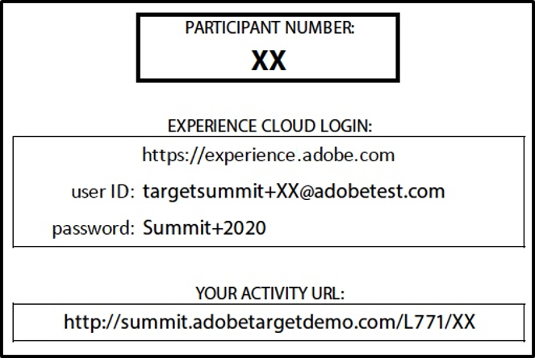

# L771, PERSONALIZE OFFERS AND EXPERIENCES WITH AI-POWERED PERSONALIZATION

## Table of Contents
- [Lab Overview](#lab-overview)
- [Lesson 1 - Adobe Experience Cloud](#lesson-1---adobe-experience-cloud)
- [Lesson 2 - Adobe Target](#lesson-2---adobe-target)
- [Lesson 3 - Automated Personalization](#lesson-3---automated-personalization)
- [Lesson 4 - Auto-Target for Personalized Experiences](#lesson-4---auto-target-for-personalized-experiences)
- [Lesson 5 - AI Activities Reporting](#lesson-5---ai-activities-reporting)
- [Additional Resources](#additional-resources)

## Lab Overview
In this training you will learn about the Adobe Sensei capabilities within Adobe Target. Adobe Sensei uses artificial intelligence (AI) and machine learning to help you discover hidden opportunities, make tedious processes fast, and offer relevant experiences to every customer.

You will learn how to setup an Automated Personalization (AP) activity. AP provides advanced machine learning algorithms to drive personalized experiences and improved conversion rates for digital experiences. We will also briefly review audience creation and rules-based targeting prior to the AP review.

We will also be taking a closer look at newer additions to Target’s Sensei features including the Auto-Target option in AB Test activities and the new Insights reporting capabilities.

> **NOTE**: At your workstation you should have a laminated card with your participant number, e.g. “99”. This number gets used for many purposes during the lab (e.g., for login credentials, your demo site URL, etc.). Wherever you see “XX” in this lab manual or in the lab exercises, replace it with your participant number.

	

# Lesson 1 - Adobe Experience Cloud

## Lesson Overview

The Adobe Experience Cloud brings Adobe's marketing solutions together into one central hub. The Cloud is where your teams can:

- Log in to all of your solutions using your Adobe ID, and launch them from one place.
- Collaborate and share content (like reports) with other Experience Cloud users in your organization.

The Adobe Experience Cloud has social sharing features to allow you and your team to collaborate on your marketing activities. It is the hub for all your activities within your Adobe Solutions.

## Exercise 1.1 - Log in to the Adobe Experience Cloud

### Objectives

- Log into the Adobe Experience Cloud
- Access your Experience Cloud solutions

### Log into the Experience Cloud

1. Go to https://experience.adobe.com
2. Click “Sign In with an Adobe ID”
3. Log in using the credentials on your desk:

 

(Don’t forget to replace the XX with your participant number)

Go back to: [Table of Contents](#table-of-contents)

# Lesson 2 - Adobe Target

## Lesson Overview

Adobe Target, accessed through the Adobe Experience Cloud, helps you visually create and manage A/B tests, rules-based targeting activities, and MVT tests. It also offers more advanced personalization features where, based on anonymous visitor data, you can change content across digital channels and properties to create a more engaging and consistent experience.

The interface offers a streamlined implementation strategy with your digital properties— just a single line of code on each page (or using our APIs!) manages all communication required between your site and Adobe Target. Industry best practices are built in to Adobe Target, designed for both new and experienced users. You can share data and results to collaborate easily with other team members.

## Exercise 2.1 – Access Adobe Target

### Objectives

Learn how to access the Adobe Target interface from the Experience Cloud

1. Click “Launch” in the Target card to open Target.

    
    
2. Additionally, from other places in the Adobe Experience Cloud, in the top right corner of the page, click the 9-dot picker icon > Target. Then Target will load.

    

## Exercise 2.2 – Audiences Review

### Objectives

Learn how to build an audience based on the Target profile attributes.

### What are Audiences?

When a visitor lands on a page where you have set up an activity, Target determines whether the visitor qualifies as a member of an audience that has been identified for the activity. If the visitor cannot be identified as a member of a target audience, that visitor is shown default content and is not included in the reports for the activity. Audiences can be used to restrict entry into any Target activity, used in explicit rules-based Experience Targeting activities, or used to filter native Target activity reports.

You can create audience targeting rules for each of the following categories:

- **Browser**: You can target users who use a specific browser or specific browser options when they visit your page.
- **Custom parameters**: Custom parameters are mbox parameters. If you pass any mbox parameters to mboxes, or use the targetPageParams function, those parameters appear here for use in audiences.
- **Geo**: Target users based on their geographical location, including their country, state/province, city, zip/postal code, DMA, or mobile carrier.
- **Network**: You can create audiences based on network details.
- **Mobile**: Target mobile devices based on parameters such as mobile device, type of device, device vendor, screen dimensions (by pixels), and more.
- **Operating System**: You can target visitors who use a certain operating system.
- **Site Pages**: Target visitors who are on a specific page or have a specific mbox parameter.
- **Target Library**: Target users based on pre-built targeting rules.
- **Time Frame**: You can add start/end dates and times to target users who visit your site during a specific time frame. You can also set Week and Day Parting options to create recurring patterns for audience targeting.
- **Traffic Sources**: Target visitors based on the search engine or landing page that refers them to your site.
- **Visitor Profile**: Target visitors who meet specific profile parameters.

## Exercise 2.3 - Create a new Audience

1. From the Target Premium Activities list, click the Audiences tab to access the Audience list, click Audiences in the top menu bar. Review the Audience list, noting that the ‘Source’ column includes segments built in Adobe Analytics and Adobe Audience Manager (indicated as ‘Experience Cloud’ for source). Next, click on the blue ‘Create Audience’ button upper right:

    

2. Next we will create a customized new audience and save them to the Target library for use in your activities. Please build an audience using the available rules by clicking ‘Add Rule’.

    

3. Try building an audience with multiple rule definitions. When you combine rules or parameters with **AND**, any potential audience member must meet all of the defined conditions to be included as an entrant. For example, if you define an OS rule AND a browser rule, only visitors using both the defined OS and the defined browser are included in the activity.

    When you combine rules or parameters with **OR**, any potential audience member need only meet any single defined condition to be included as an entrant. For example, if you define multiple mobile rules connected by OR, visitors meeting any of the defined criteria are included in the activity.

    

4. Give your audience a unique name (e.g. start name with your initials so you can easily find it later) and click the blue ‘Save’ button. Once you return to the audiences list, search for your initials to ensure that your audience was saved properly and is available to be used in an activity.

## Exercise 2.4 – Create an Experience Targeting Activity

Before diving into automated AI-driven personalization, let’s first quickly review manual rules-based targeting via the Experience Targeting activity type.

1. Return to the Activities menu within Target Premium and select an Experience Targeting from the blue ‘Create Activity’ button, upper right.

    

2. Please modify the default Activity URL by replacing the ‘XX’ at the end of the default URL string with your Lab participant number (e.g. if you were participant number ‘99 it would be http://summit.adobetargetdemo.com/L771/99), then click the blue ‘Next’ button.

    

3. Enable mixed content
    - After launching the VEC, you will need to enable mixed content in the browser in order to set up our first activity (because our demo site runs *http* while Target is on *https*). Follow the instructions for Chrome according to the screenshot below.
    - Click the lock or caution icon, then click Site settings.
        
    - Scroll to Insecure content, then use the drop-down list to change Block  to Allow.
        
    - Return to the tab with Target and click the reload button.
4. You should enter the 3-step workflow to create an XT (Experience Targeting) activity. On the Experiences step (step 1), please give your activity a unique name (e.g. using your initials as a prefix) in the upper left, and select ‘Add Experience Targeting’ in the left rail.

    

5. Please search for the audience you created in the ‘Choose Audience’ step and then click the blue ‘Done’ button, upper right.

    

6. Proceed to step-2 ‘Targeting’ step by selecting the blue ‘Next’ button, upper right. On this step, it is important to prioritize audiences if they can overlap. Visitors will qualify in order from top to bottom so move up any higher priority audiences. There is one exception: the All Visitors audience is always considered last regardless of its placement.

    

7. Click the blue ‘Next button, and proceed to step-3 ‘Goals & Settings’ and plug-in some goal metrics. This Lab assumes familiarity with these activity set-up settings, and so we won’t do a deep-dive into each option on step-3.

    You can simply choose: Conversion > Clicked an Element > Select Elements > pick some element from the page such as the hero image.
    
    After defining a goal, you can add ‘Audiences for Reporting’. This allows you to filter your activity report by any defined audience. Select the + button here and add the audience you created in Exercise 2.3.

    

That completes Lesson 2, which was designed as a quick review of rules-based targeting prior to the primary Lab focus on AI-driven targeting.

Go back to: [Table of Contents](#table-of-contents)

# Lesson 3 - Automated Personalization 

## Lesson Overview

Automated Personalization (AP) provides advanced machine learning algorithms to drive personalized experiences and improved conversion rates for digital experiences.

Automated Personalization (AP) enables them to point and click on any content and visually create and select additional content options for that area. Then, the modeling system automatically determines which piece of content to deliver to each individual based on all the behavioral data the system has about the visitor.

- Setup an AP Activity
- Understand the differences between AP and other Activity types

## Uploading Data for Target's Personalization Algorithms

Offline data, such as CRM information or customer churn propensity scores, can be incredibly valuable when building personalization models. Additionally, any data available in the visitor profile or segments shared from Experience Cloud audiences can provide valuable insights for Sensei’s automated decisioning and model building. 

There are several ways to input data in Automated Personalization (AP) and Auto-Target personalization algorithms.

- Experience Cloud shared audiences (Adobe Analytics, Audience Manager)
- Profile / mbox parameters
- Customer Attributes
- Server-side APIs for profile update
- Manually curated interest areas setup via Adobe Professional Services

Please refer to the table on the following page for a full list and details of the possible data sources that Sensei uses in its model building. 

Data Type | Description | Example Variables
--------|---------|---------
Shared Audiences|Audiences created through Adobe Audience Manager or Adobe Analytics and shared with Target.|Custom data
URL Parameters|Target inspects the URL to extract the URL parameters.|Custom data
Customer Attributes|Offline data imported into the Experience Cloud via the Customer Attributes import and data subscription process.|Custom data
User Profile Parameters|Any information you've decided to include in Target's user profile. This information could come from profile scripts, Profile Update API, or in-mbox profile parameters prefixed with "profile."|Custom data
Environmental and Session data|Information about how and when the user is accessing the activity.|E.g., Time of Day, Day of Week, Operating System, Browser Type, Browser Language, Screen Height/Width, Session Duration
Geography|Information on where the visitor is located.|E.g., City, Country, Region/State, Zip Code, Latitude, Longitude, ISP or Mobile Carrier
Device and Mobile Data|Device and mobile-specific information.|E.g., Mobile Device OS, Mobile Screen Size

## Exercise 3.1 – Create your First AP Activity 

In this exercise you will be using the Visual Experience Composer (VEC) to add your offers to the activity.

The setup of an AP activity is very similar to that of an A/B test with one key difference. Rather than having a Menu for your different experiences, you make all your changes on a single “experience”. You have the option of testing multiple versions of each area of the page that you change. The key here is that this works similarly to a Multivariate test, as each possible combination of changes will be tested. Therefore, AP is usually best run on pages with significant traffic.

1. From the Target Premium Activities list, click:
    Create Activity > Automated Personalization.

2. In the field labeled “Enter Activity URL”, replace the “XX” with your lab number then click Next. Your demo site will load within the VEC.

    

3. Click anywhere within the page to begin setting up the activity’s experiences.

4. First we will be adding some alternate hero banners to the activity. Click on the hero banner (the main banner image going across the page) and select “Change Image”, the image offer library will open.

    

5. Select the alternate versions of the hero banner by clicking on the images that you would like to include in your activity.

    

    > **Tip:** Target gives you option here to include your site’s default content as part of the activity. In this scenario, the default content will be served from your activity as if it was any other offer. AP will try to optimize the default content by showing it to visitors who may be more likely to convert on the default content. If you wish to include the default hero banner as part of the activity, then leave that selected as well. If the default hero banner should be excluded, then clicking on it will unselect it and it will be removed from the activity.

6. After you have selected the alternate hero banners, Click the “Save” button to return to the VEC.

7. Scroll down on the page and click on the text blurb located directly under the hero banner. Select the “Change Text/HTML” option.

    

8. Modify the text from the WYSIWYG editor.

9. Click “Add Text/HTML offer” to add more variants/offers to this location of the activity.

10. After creating several options of altered text, click the “Save Button”.

## Exercise 3.2 - Add Offer Level Targeting

Offer level targeting can be applied to each individual offer so that the content is only *eligible* for a particular audience. An example of a use case where a marketer would apply offer level targeting, let’s say you have multiple levels of customer loyalty (Gold, Platinum), and you have content within this AP activity that should only be shown to visitors when they belong to a particular audience. Offer level targeting allows you to do just that.

1. Click the Manage Content icon to pull up the “Manage Content” window.

    

2. Click on the ‘Offers’ tab (as shown highlighted below). Select the offers that you would like to apply the targeting rules to.

    In this example, we are selecting two of the offers to be served only when visitors are Gold Status members. However, there are many different Targeting options that can be applied to meet your specific use cases.

    

3. Click the “Targeting” option.

    

4. Select an Audience from the list.

    For example, we have selected “Gold Status” from the below list. Only visitors who have a customer level status of Gold will see the offers that have this targeting applied. Feel free to create your own audience here as well using the “+ Create Audience” option.

    

5. Click “Done” to apply the targeting. Your content list should now look similar to the shown screenshot.

    

6. Now click “Done” to return to the VEC main page.

    > **Advanced tip:** If there are any combinations of offers that should never be displayed together to a visitor in a single experience, you can use exclusions to choose any combinations that you want to exclude from the activity.

    

7. Once you are ready, click the “Next” button to move on to the next step.

## Exercise 3.3 – Target your Activity

It’s time to configure the activity targeting that will be used for this AP activity. First, we will be adding an audience to the activity. In the previous step, we selected an audience at the individual offer level. In this step, we will be adding an audience at the activity level. At this level of targeting, we are deciding who should be allowed into the activity. Whereas with the offer level targeting from the previous step, we were deciding what pieces of content should be available to particular audiences once those audiences were entered in the activity.

1. Click the down arrow icon next to the “All Visitors” text and select “Replace Audience” to open the Audience library.

2. From the audience list, you have two options:
    - Select an existing audience – You can choose to use the audience you created previously or choose something like “Chrome Browser” so you can easily qualify.
    - Or you could also create a new audience by clicking the “+ Create Audience” button, naming it, and defining a new rule. You can keep it simple like: Site Pages > Current Page > URL > contains: L771
    
    - Once you have finished configuring your new audience, click the “Save” button to save it. This will take you back to the audience list.

3. From the audience list, select your chosen audience, and click the “Done” button which will apply this audience to your activity.

## Exercise 3.4 - Activity Goals and Settings

The last step is selecting your Primary Goal metric. This is particularly important for AP Activities, as the algorithm optimizes to this type of conversion. You can still add additional metrics as well, but the algorithm will adjust traffic based on each variation’s performance against this primary metric. Therefore, it is important to choose carefully and select the metric that is most suitable for the activity. If you are unsure about which primary metric is right for the activity, click through rate is a good starting place.

1. Scroll down the page until you see the section for Reporting Settings. It should look something like the below screenshot:

    

    > **Advanced tip:** There are two types of optimizing goals, Conversion and Revenue. **Conversion** can be used to: track clicks, views of a particular page, or when a custom mbox request is made. **Revenue** can be used optimize to Revenue per Visitor (RPV).

    > **Please note:** that for optimizing towards revenue, there is additional implementation that requires the passing in of order information into Target. The following parameters should be passed through any mbox at the time of conversion.

	Parameter|Description
	---|---
	orderId|Unique value to identify an order for conversion counting. The orderId must be unique. Duplicate orders are ignored in reports.
	orderTotal|Monetary value of the purchase. Do not pass the currency symbol. Use a decimal point (not a comma) to indicate decimal values.
	productPurchasedId|Comma-separated list of product IDs purchased in the order. These product IDs display in the audit report to support additional reporting analysis.

2. For this exercise, choose Conversion as your primary metric.

    

3. Next we will define the conversion event. Select “Clicked an element” and then click on the “Select elements” button. This will take you back into the VEC to define your click event(s).

    

4. Click on the hero banner to select it. After clicking on it, you should see the banner will have a blue border around it.

    

5. Once you have selected the hero banner, click on the checkmark seen on the very top right corner of the page. This will take you back to the Goals and Setting page.

    > **Advanced tip:** There can be cases where you’d like to report against a metric that is deeper in the conversion funnel than the metric you are choosing to optimize against. In this case, you’d add the optimizing metric (e.g., banner clicks) as the “Primary Goal”. Then you’d uncheck the “Same as Optimization Goal” check box and add your final metric as the “Conversion Goal”. You can also add additional secondary metrics if desired.

6. Lastly, let’s give this Activity a name. Found in the very top left of the page, click on the “Untitled Activity” text and specify a name. Please use your lab participant number in the name of your Activity. For example: Automated Personalization Lab – participant XX

    

7. Now we are ready to save the Activity. Click the “Save” button located in the top right corner of the page.

    

### Syncing and Activating
On the top left of the Overview page, you will see a spinning “synching” notice on the top right of the screen for a few moments. At this point, the test is synching with the Target delivery network.

Once an activity is synched a status button will appear next to the “Edit Activity” button. Click it and choose to activate our activity.

### Preview Links (Optional)

Before launching your test, you might wish to have your QA team review your test experiences.

1. Click the “Preview Experiences” link to open the Experience URLs overlay.

    

2. To generate the preview links, click the blue “Generate all” text link

    

    These URLs will allow you to jump directly to a test experience:

    

    > **Tip**: to share or socialize these links, you can copy and paste the links into an email or document.

3. Click “Activities” from the main menu to go back to the activities list and confirm that your activity is Live.

Congratulations! You just launched your first Automated Personalization Activity with Adobe Target!

### Model Build Timing

Automated Personalization uses a Random Forest algorithm, as its main personalization algorithm to determine the best experience to show a visitor. Over time, the algorithm learns to predict the most effective content for different types of visitors and displays that content to them.

It takes time for the machine learning to build a model for each offer/reporting group. The time it takes for the models to be built is dependent on the level of traffic and the number of conversions. In the AP Offer level report, you can see if a model has been built. Highlighted below you will see either a clock icon (needs more time) or a checkmark (model successfully built) for each offer/reporting group.

Go back to: [Table of Contents](#table-of-contents)
